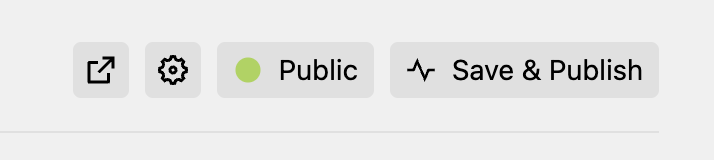

# Kirby Save And Publish Button

This plugin provides adds a button in the header button bar that saves and publishes the current page with only a single
click! Especially useful for when you are using Kirby as a blog system.

## Installation

1. `composer require pwaldhauer/kirby-save-and-publish-button` or copy the files to the `site/plugins` folder.

## Caveats

Since kirby currently does not provide a hook to add buttons to the button bar, this plugin just adds the button using
the DOM so it may be buggy.

## License

MIT
